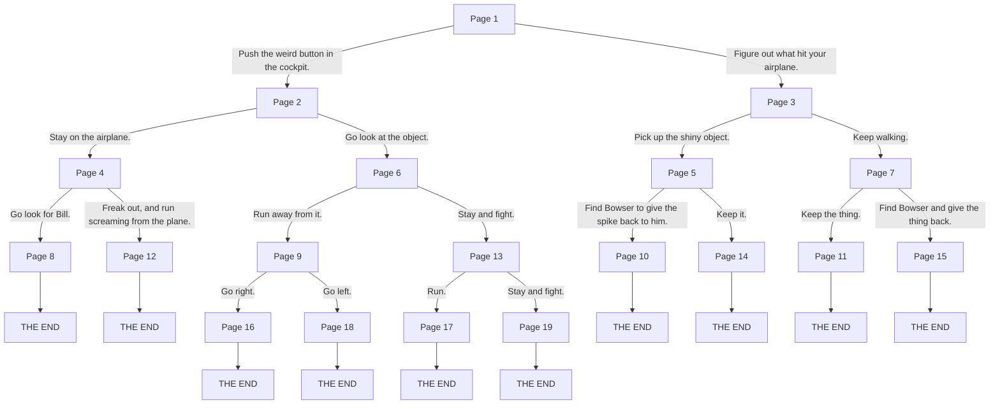

# The Game Tree

```mermaid
flowchart TD
  P1["Page 1"]
  P2["Page 2"]
  P3["Page 3"]
  P4["Page 4"]
  P5["Page 5"]
  P6["Page 6"]
  P7["Page 7"]
  P8["Page 8"]
  P9["Page 9"]
  P10["Page 10"]
  P11["Page 11"]
  P12["Page 12"]
  P13["Page 13"]
  P14["Page 14"]
  P15["Page 15"]
  P16["Page 16"]
  P17["Page 17"]
  P18["Page 18"]
  P19["Page 19"]
  E8["THE END"]
  E10["THE END"]
  E11["THE END"]
  E12["THE END"]
  E14["THE END"]
  E15["THE END"]
  E16["THE END"]
  E17["THE END"]
  E18["THE END"]
  E19["THE END"]

  P1 -->|"Push the weird button in the cockpit."| P2
  P1 -->|"Figure out what hit your airplane."| P3
  P2 -->|"Stay on the airplane."| P4
  P2 -->|"Go look at the object."| P6
  P3 -->|"Pick up the shiny object."| P5
  P3 -->|"Keep walking."| P7
  P4 -->|"Go look for Bill."| P8
  P4 -->|"Freak out, and run screaming from the plane."| P12
  P5 -->|"Find Bowser to give the spike back to him."| P10
  P5 -->|"Keep it."| P14
  P6 -->|"Run away from it."| P9
  P6 -->|"Stay and fight."| P13
  P7 -->|"Keep the thing."| P11
  P7 -->|"Find Bowser and give the thing back."| P15
  P9 -->|"Go right."| P16
  P9 -->|"Go left."| P18
  P13 -->|"Run."| P17
  P13 -->|"Stay and fight."| P19
  P8 --> E8
  P10 --> E10
  P11 --> E11
  P12 --> E12
  P14 --> E14
  P15 --> E15
  P16 --> E16
  P17 --> E17
  P18 --> E18
  P19 --> E19
```
