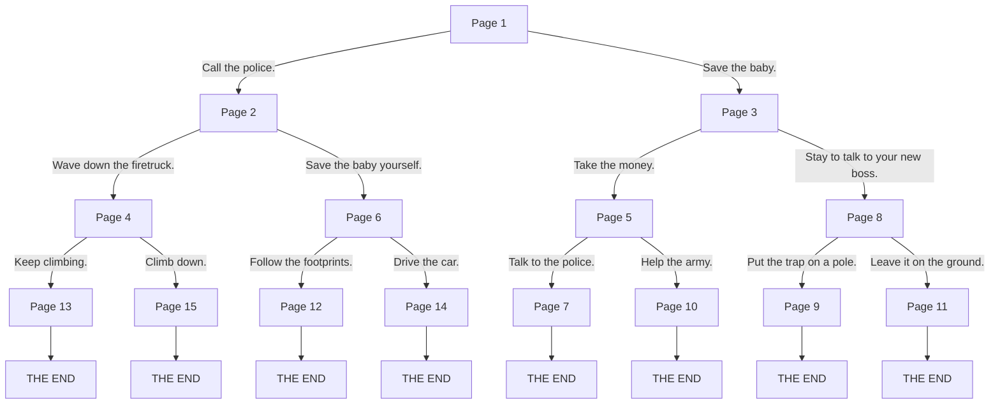

# The Legends of London Tree

```mermaid
flowchart TD
  P1["Page 1"]
  P2["Page 2"]
  P3["Page 3"]
  P4["Page 4"]
  P5["Page 5"]
  P6["Page 6"]
  P7["Page 7"]
  P8["Page 8"]
  P9["Page 9"]
  P10["Page 10"]
  P11["Page 11"]
  P12["Page 12"]
  P13["Page 13"]
  P14["Page 14"]
  P15["Page 15"]
  E7["THE END"]
  E9["THE END"]
  E10["THE END"]
  E11["THE END"]
  E12["THE END"]
  E13["THE END"]
  E14["THE END"]
  E15["THE END"]

  P1 -->|"Call the police."| P2
  P1 -->|"Save the baby."| P3
  P2 -->|"Wave down the firetruck."| P4
  P2 -->|"Save the baby yourself."| P6
  P3 -->|"Take the money."| P5
  P3 -->|"Stay to talk to your new boss."| P8
  P4 -->|"Keep climbing."| P13
  P4 -->|"Climb down."| P15
  P5 -->|"Talk to the police."| P7
  P5 -->|"Help the army."| P10
  P6 -->|"Follow the footprints."| P12
  P6 -->|"Drive the car."| P14
  P8 -->|"Put the trap on a pole."| P9
  P8 -->|"Leave it on the ground."| P11
  P7 --> E7
  P9 --> E9
  P10 --> E10
  P11 --> E11
  P12 --> E12
  P13 --> E13
  P14 --> E14
  P15 --> E15
```
